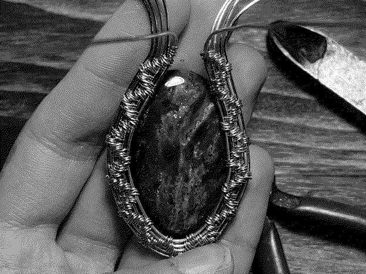
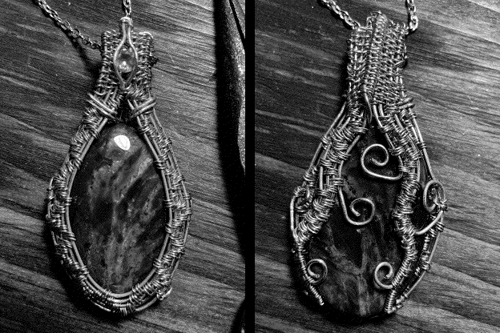
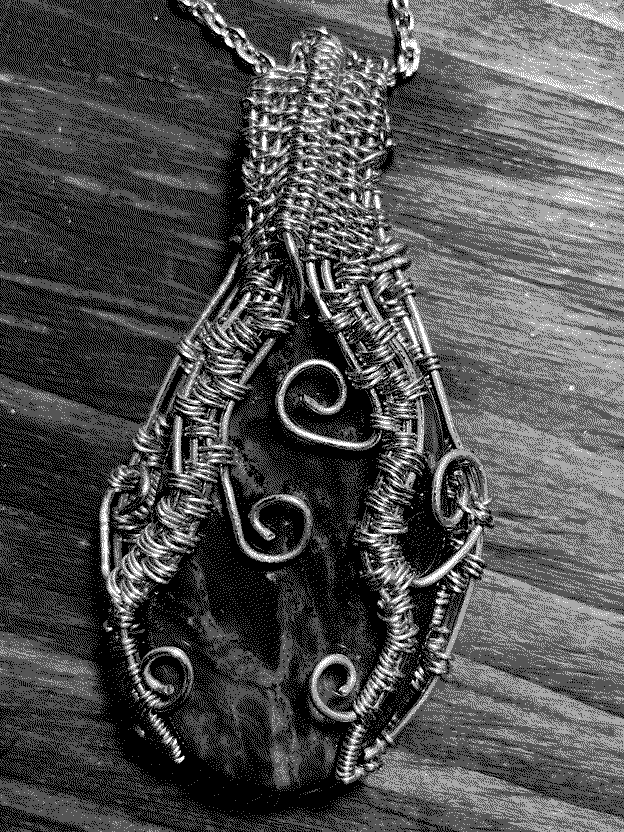

Recently, I surprised my girlfriend with a pendant that I wire-wrapped for her birthday. She makes lovely jewelry herself, and I've been lucky to receive many pieces from her in the past. Unbeknownst to her, I became interested in the craft over the past few weeks and decided to learn wire-wrapping so I could make *her* something for a change.

It's my first piece of jewelry, and I'm overjoyed that she loved it! What's more is that I've never been much of a gifter, but crafting this from the choice of stone to the wax seal stamp has made me realize that I love gift-giving. Here's a bit of my process.

<figure><figcaption>Getting started on the front of the wrap.</figcaption></figure>

First, I ordered the choicest bloodstone cabochon (a shaped and polished stone) off of Etsy. Bloodstone is one of the March birthstones, along with aquamarine. As an aside, it irks me that birthstones are largely a marketing ploy by the gem industry. I wish I could find more reliable sources for their historical bases, but bloodstone is beautiful nonetheless. Anyway, I also ordered a 5mm faceted (cut) citrine gem to match the hints of yellow in the bloodstone. 

I bought the last remaining coils of 20g and 26g copper wire from Michaels' ransacked shelves, raided my dad's basement workshop for some wire cutters and pliers, and got to following [a great tutorial](https://www.youtube.com/watch?v=7YLAEE0fHpE){:target="_blank"} from Ellie's Handcrafted Jewelry.

As it was my first time wire wrapping, I struggled to get my base wires straight and couldn't keep Goldilocks tension on the weaving wire. You can see the unevenness of my first weaves in the picture above. Slowly, I improved throughout the project---the weaves on the back are far cleaner, pictured below.

<figure><figcaption>Front and back of the finished piece.</figcaption></figure>

I don't think the wires I bought were quite "dead-soft," as is recommended for wire wrapping, so that may have made things more difficult. The gauges were perhaps too similar, making the piece clunkier than it could've been. It also would've been nice to have round nose pliers to make cleaner swirls on the back. All lessons for future pieces.

After finishing, I lay the pendant in a cute purple box that once carried me a handmade piece of her own. I wrapped it in a way that would please Julie Andrews, and finished it off with a wax seal a la [Rajiv Surendra](https://www.youtube.com/watch?v=vm3dR4jhImU){:target="_blank"}.

<figure></figure>
