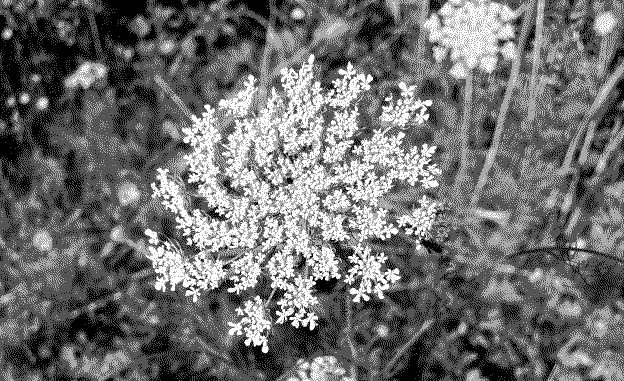

I don't know anyone who schleps their 900-page plant identification key---called a Flora---through the woods, whipping it out at every untried posy. Chances are, you don't want to break your back in the name of flower identification.

When I first began identifying plants, I'd take a few pictures of a flower, run home to key it out, and hit a wall because I couldn't remember if the phyllaries on the underside were *really* hairy or just a little hairy. Minute details like that always threw me off a flower's tracks, and I quickly realized that I couldn't make do with my aimless documentation.

There are a few important flower parts that will guide you through the many forks in the identification road:

1. The **face** of the flower shows you its male and female organs, or the androecium and gynoecium respectively. And petals, of course.
2. The **underside** of the flower is where you'll get a close-up of the stem and those (usually) green petal-looking things called sepals (sometimes phyllaries) right below the petals. Here you can look for hair or lack thereof.
3. If there are multiple flowers rising from one main stem, you're looking at an **inflorescence**. There are many different types of inflorescences, categorized with funny words like "umbel" and "corymb."
4. **Leaves** have lots of important qualities for identification, such as their shape or the way they're attached to the stem. The top and bottom of a leaf can be different, so make sure to take photos of both sides.
5. Last and technically most, you'll want a photo of the **entire plant**. This shows you the arrangement and distribution of leaves up the stem, along with other macro-level details. If something is missing from the other photos, you can zoom in on this one to try catching it.

When I'm getting nowhere with identification, I'll upload photos to iNaturalist to narrow the plant down to a genus. If you do this, I suggest working backwards from that genus in the key to learn about its features. This way, you'll be able to identify it without relying on image searches in the future.

<figure><figcaption><i>Daucus carota</i> (Queen Anne's Lace), inflorescence an umbel</figcaption></figure>

This will get you through most identifications, but sometimes it might not be enough---especially when dealing with more nuanced families or genera. When you study difficult taxa, look over the key before you go out; it'll tell you exactly what to look for. Or you could just take the Flora.
