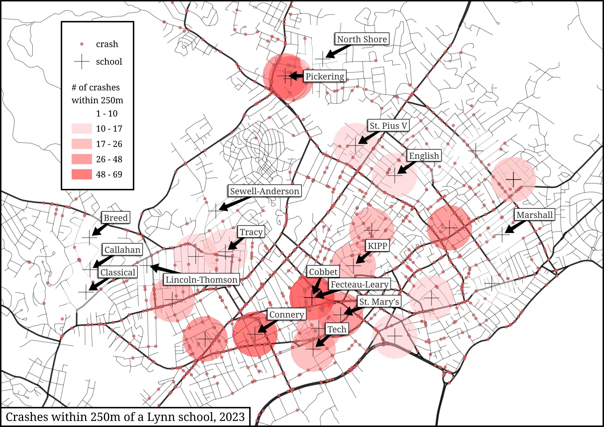

As a very early headstart on my minor in Geospatial Imaging and Analysis, I've made my first foray into GIS using the free and open-source [QGIS](https://www.qgis.org/){:target="_blank"} to visualize the number of car crashes within 250 meters of schools in Lynn.

I began by skimming through Matt Forrest's [wonderful tutorial](https://www.youtube.com/watch?v=SovdBaus7pM){:target="_blank"} and then picked up some school and crash data from [MassGIS](https://www.mass.gov/orgs/massgis-bureau-of-geographic-information){:target="_blank"}. The map doesn't really say anything, especially given that nearly none of those crashes involve pedestrians under 20 years old, but nonetheless it was a good primer for me.

<figure class="bigimg"></figure>

Hopefully I can make some more beautiful maps moving foward. I want to explore different topics like walkability, biodiversity, music, and even psychogeography with GIS. But for now, I'm happy with what I've created. Not so happy with the file size.
