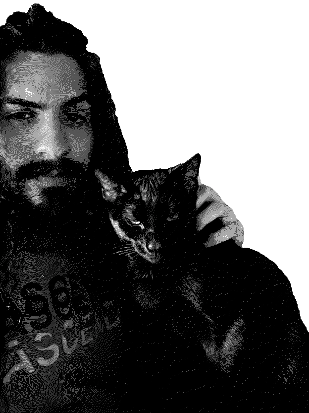

 <figure></figure>
I'm a
{{"now"|date:"%Y%m%d"|minus:"20060713"|slice:0,2}}-year-old
musician and student of nature. This is where I write about
what I learn and what I like.
 <figcaption
style="float:right;">me and Bisi</figcaption>

## latest posts

<ul>
    
    
    <li>
      <a class="post" href="{{post.url}}">
      
{{post.title}}

      
{{post.date|date:'%D'}}

      </a>
    </li>
    
</ul>

