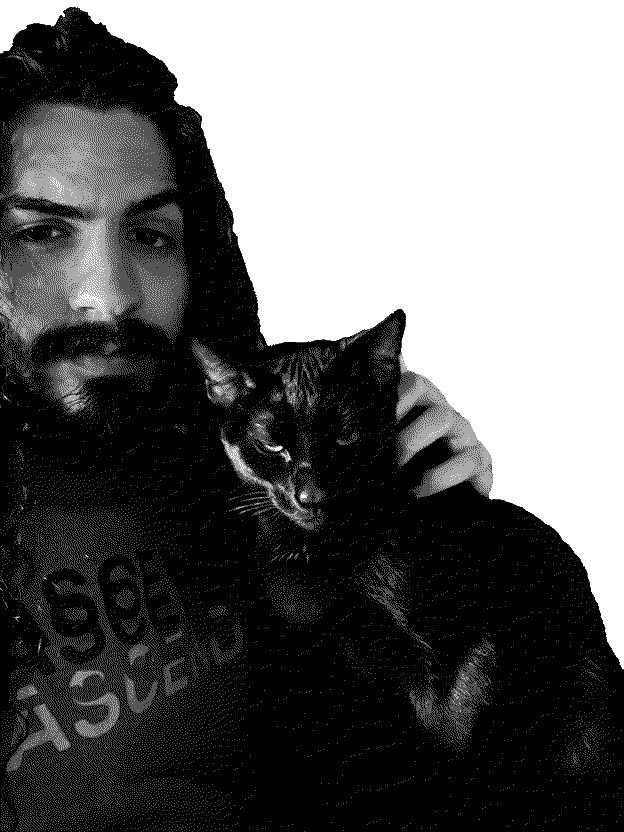

I'm a {{"now"|date:"%Y%m%d"|minus:"20060713"|slice:0,2}}-year-old musician and naturalist writing about what I learn and what I like.

And this is my cat Bisi.

<h2>now <small>as of 8/4/26</small></h2>

I've been playing a lot of sports this summer: tennis,
pickleball, basketball, and for the first time, beach
volleyball. At home, I've discovered a love for improv
comedy and TTRPGs via
[Dropout](https://www.dropout.tv/){:target="_blank"}, and
I've since started playing my first D&D campaign with some
old chums.

I've also been photographing concerts for my friends
[Opaline](https://www.instagram.com/opaline_978/){:target="_blank"},
who've just dropped their first CD; for Nick Shea celebrating the
release of his album [The Guy Who
Draws](https://nickshea.bandcamp.com/album/the-guy-who-draws){:target="blank"};
and for nonprofit
[AccessCulture](https://accessculture.org/){:target="_blank"}'s first
world music events of the year.

As for my own endeavors, I'm practicing for an upcoming show
with my impromptu band Lady Fortuna; preparing to lead two
church services on the organ this month; working on my oud
technique; building and rebuilding websites; pondering what
makes for good experiences; and still struggling to land a
job.

That's all for now, folks.
## [latest posts](/musings.html)



<article>
  <a class="post" href="{{post.url}}">
  
{{post.title}}

  <small>{{post.date|date:'%D'}}</small>
  </a>
</article>

