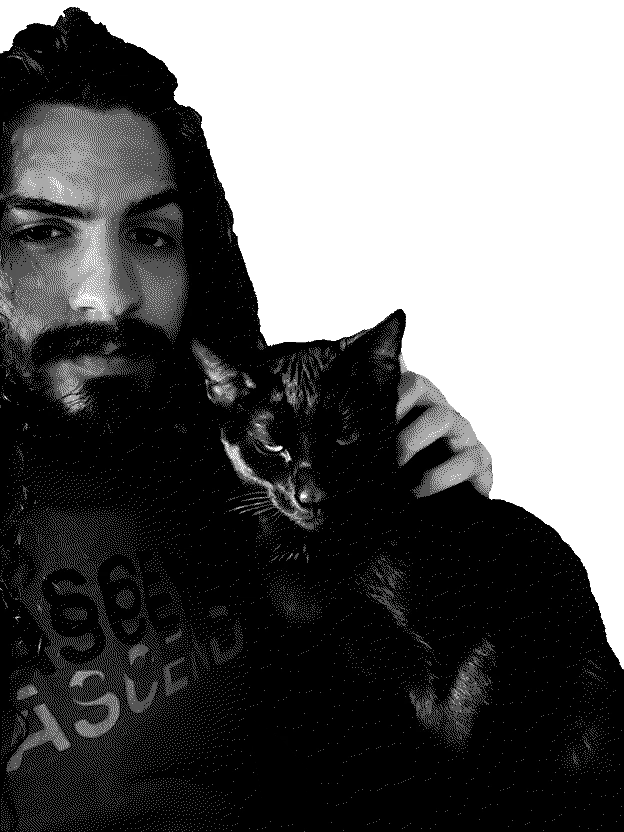

I'm a {{"now"|date:"%Y%m%d"|minus:"20060713"|slice:0,2}}-year-old musician and naturalist writing about what I learn and what I like.

And this is my cat Bisi.

<h2>now <small>as of 1/24/25</small></h2>

I am reunited and once again enamored with the piano thanks
to my lovely church gig. It's inspired me to audition for my
university jazz ensemble, and the audition went swimmingly.
I'm back on the grind.

Started playing pool on my new eight-foot table, which I
acquired for free off Craigslist. I've also been enjoying
pickleball with a couple of friends. We're running a
fantasy tennis league this year, which I'm helping to
develop an app for.

I've been falling in love with fiber arts lately. I've just
finished my first crochet project: a pair of colorful
fingerless gloves which are now the warmest gloves I own.
I'd love to learn how to weave, sew, and knit.

My winter break has come to an end, but it's been pretty swell.
I hope things are swell with you too.

## [latest posts](/musings.html)



<article>
  <a class="post" href="{{post.url}}">
  
{{post.title}}

  <small>{{post.date|date:'%D'}}</small>
  </a>
</article>

